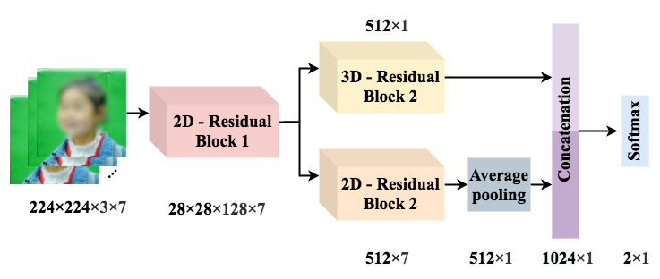

# Responsive Social Smile: A Machine Learning based Multimodal Behavior Assessment Framework towards Early Stage Autism Screening

This paper proposes a machine learning based assessment framework for early ASD screening. By integrating speech recognition and computer vision technologies, the proposed framework can quantitatively analyze children’s behaviors under well-designed protocols. We collect 196 stimulus samples from 41 children with an average age of 23.34 months, and the proposed method obtains 85.20% accuracy for predicting stimulus scores and 80.49% accuracy for the final ASD prediction. This result indicates that our model approaches the average level of domain experts in this ”Responsive Social Smile” protocol.

The latest version paper is [here](https://www.researchgate.net/publication/343489410_Responsive_Social_Smile_A_Machine_Learning-based_Multimodal_Behavior_Assessment_Framework_towards_Early_Stage_Autism_Screening).

# Network Structure

This repository implement the facial expression recognition part. It proposes a CNN-based model to capture both spatial and temporal features for facial expression recognition. The network structure(tfennet.py) is mainly made of 4 parts: the 2D residual block, the 3D-CNN branch, the 2D- CNN branch, and the fusion layer. 

# Procedure

## 1.Prepare on OULU-CASIA. 
__[Dataset Description](http://www.ee.oulu.fi/~gyzhao/Download/Databases/NIR_VL_FED/Description.pdf)__

file: [1_OuluDataRaw.ipynb](1_OuluDataRaw.ipynb)

## 2. Pretrain on OULU-CASIA.

file: [2_OuluDataPretrain.ipynb](2_OuluDataPretrain.ipynb)

## 3. Finetune on a children's face dataset.

file: [3_FinetuneOnChildrenFace.ipynb](3_FinetuneOnChildrenFace.ipynb)

# Model
All needed model can be download [here](https://pan.baidu.com/s/14iycYUDVtJIyEJHgzePSNQ)Password:snb8
* Finetuned model on a children's face dataset: tfen_adjustlr0.01_sstep70_finetune_children.pkl
* Pretrained model on OULU-CASIA: tfen_oulu_netall.pkl

